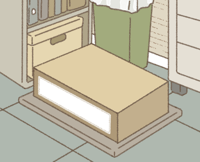

# 疊箱子小遊戲規格與視覺校正經驗

本文件記錄公司整理櫃子的疊箱子小遊戲，包含一般版／進階版玩法、結算得分、貼紙裁切規則與美術校正經驗。
若文件與程式碼不同，玩法以 `src/components/game/events/CabinetBoxStackMinigameModal.tsx`、
得分以 `src/lib/game/cabinetBoxScoring.ts`、貼紙裁切以 `src/lib/game/cabinetBoxStickers.ts`、
透視校正以 `src/lib/game/cabinetBoxProjection.ts` 為準。

## 遊戲定位與入口

- 承載容器：既有的工作事件 modal，不是獨立 page 或新的手機外殼。
- 主要元件：`CabinetBoxStackMinigameModal`。
- 展覽版測試網址：`/game/exhibition?preview=box-game&lang=zh`。
- 錯向箱變體測試網址：`/game/exhibition?preview=work-clicker&lang=zh`。
- Figma 參考：`走走小日 2026`，節點 `12616:149`。
- 操作：整個遊戲舞台都可點擊；點擊時將移動中的箱子落下。
- 鍵盤：`Space`／`Enter` 放置，`Escape` 離開。

主畫面依 Figma 保持極簡，只保留：

1. 上方花紋橫幅
2. 目前正在放置的層數
3. 堆箱舞台
4. `GameFrame` 原本提供的右上選單

不要在 modal 內重做第二顆選單，也不要重新加入速度、方向、提示、進度句或放置按鈕。
失敗與完成 overlay，以及只在關鍵落點短暫出現的刺激文字，屬於必要狀態，可以保留。

## 錯向箱變體

展覽流程的第二次箱子遊戲 `work-clicker` 使用 `variant="dispatch"` 與
`motionVariant="wrong-way"`。`dispatch` 沿用舊名稱，目前規則是持續堆高直到落空：

- 不以 9 箱或 14 層作為結束條件；每完成 3 層只短暫顯示目前層數。
- 完全落空後結算本次堆疊層數，再銜接後續流程，不重送當前箱。
- 結算星等依總分 700／1,400／2,200 分判定，明細含層數、用時、貼紙與瞬翻即放。
- 成功把錯向箱轉正並放下後，下一箱帶有 1～2 張貼紙。兩張時左右可見箱面各一張，一張時交替出現在其中一面；款式依原貼紙（N）→ R → SR 輪替。
- 貼紙固定在原箱面位置，裁切後完整留在疊好箱體上的才逐張計分；掉落碎塊上的貼紙不算獲得。切到貼紙本身時保留兩側的裁切圖像，但不把殘片當作完整貼紙發獎。

目前 `cabinetBoxMotion.ts` 和開發版快捷入口只提供 `wrong-way`。舊版的 `one-way`、
`tempo-shift`、`corner-turn`、`accelerating-bounce`、`brief-stop` 已不在可選清單。

每 3 箱中的第二箱會出現錯向，輪替為水平旋轉 `90°` 或放倒成標籤朝上；標籤朝上時，
旋轉後露出的原底面改貼上表面材質。側轉箱以左右滑動轉正，標籤朝上箱則由上往下滑動
轉正；明顯滑動不會觸發放置，短點擊才會直接放下。鍵盤可用左右方向鍵修正側轉箱、
下方向鍵修正標籤朝上箱。

直接網址可使用 `/game/exhibition?preview=work-clicker&boxMotion=wrong-way&lang=zh`。

未傳 `variant` 時仍是 `archive` 模式，14 層為固定終點。落空時總分達 700 分便可完成，未達則重試；兩版共用得分制，只有進階版具備瞬翻即放加分及獎勵貼紙列。

## 玩法與判定

- 星等以總分判斷：700 分 1 星、1,400 分 2 星、2,200 分 3 星
- 一般版 14 層完成；達 14 層不保證 3 星，速度與貼紙也計入總分
- 第 7 層仍是「剩一半」的進度提示
- 每層速度倍率增加：`0.18`
- 完美容許值：`6`
- 無有效重疊：失敗
- 通關後若後續箱子落空：保留已取得成績並結算

### 紙卡結算

完成與通關前落空共用 `CabinetBoxStackResultOverlay`，覆蓋在現有遊戲舞台上。
背景與箱塔保持可見，疊一層半透明暗幕，再顯示手繪紙卡；不再使用關櫃門的完成畫面。

- [結算參考稿](https://www.figma.com/design/9ased7HFhhFpvVNl3WPrdK?node-id=13096-2748)
- [紙卡背景出圖](https://www.figma.com/design/9ased7HFhhFpvVNl3WPrdK?node-id=13096-2866)
- 本地原始素材：`result-paper.png`（643 × 758，透明背景）、`result-star-earned.png`、`result-star-empty.png`，均位於 `public/images/minigame/box_stacking/`。
- 紙卡使用節點 `13096:2866` 的 `exportAsync({ format: "PNG", contentsOnly: true, useAbsoluteBounds: true })` 匯出，保留透明邊緣，避免把 Figma 畫布灰底一併帶入。
- 層數、貼紙與瞬翻次數都只統計成功放置的箱子。堆疊用時從第一箱開始移動，計算至最後一箱成功放置，包含中間的落地動畫；最後落空的等待時間不影響已取得成績。重試全部歸零。
- 紙卡顯示每項數量及加分、總分，星星下方標示 700／1,400／2,200 分門檻。亮星依序彈入，減少動態效果設定下停用動畫。進階版額外顯示 N／R／SR 獎勵圖案與數量。
- 移除「這次的整理紀錄」、星星下方評語與「稍後再做」按鈕。一般版未達 700 分落空只提供「再試一次」；成功結算（包含錯向箱落空）提供「完成」。玩家確認後才銜接劇情，不自動離開。
- 結算按鈕支援滑鼠、觸控及鍵盤，焦點預設停在主要按鈕；按鈕事件不傳入下層堆箱操作。
- 繁中、日文、英文共用版型；紙卡依舞台寬高縮放。

### 得分設計

所有數值集中在 `src/lib/game/cabinetBoxScoring.ts`，方便後續依玩家實測調整。

| 項目 | 規則 |
| --- | --- |
| 層數 | 成功一層 +100 分 |
| 速度 | 平均每層 ≤1.5 秒，該局每層 +50 分；≥4 秒不加分；中間線性遞減，總和四捨五入 |
| 原貼紙 N | 每張 +50 分 |
| R 貼紙 | 每張 +100 分 |
| SR 貼紙 | 每張 +150 分 |
| 瞬翻即放（進階版） | 錯向箱尚未碰到移動邊界折返，且翻正後 0～400ms 內成功放下，每次 +100 分 |

速度分數為 `round(層數 × 50 × clamp((4 − 平均秒數) / 2.5, 0, 1))`。
未成功疊起任何一箱時，時間、貼紙、瞬翻及總分皆為 0。

星等：0～699 分為 0 星，700～1,399 分為 1 星，1,400～2,199 分為 2 星，2,200 分起為 3 星。

校準範例：

- 一般版 7 層／17.5 秒／N、R 各 1 張：700 + 210 + 150 = **1,060 分（1 星）**。
- 一般版 10 層／25 秒／N、R 各 1 張：1,000 + 300 + 150 = **1,450 分（2 星）**。
- 一般版 14 層／28 秒／N、R、SR 各 1 張：1,400 + 560 + 300 = **2,260 分（3 星）**。
- 進階版 12 層／24 秒／N 2 張、R／SR 各 1 張／瞬翻 4 次：1,200 + 480 + 350 + 400 = **2,430 分（3 星）**。

翻轉太早而等待超過 400ms、經過折返、沒有翻轉，或翻正後落空，皆不給瞬翻分。
落空的貼紙箱不算獲得。進階版只統計留在成功疊起箱體上的完整貼紙，最多每個獎勵箱 2 張；即使箱體成功放下，貼紙隨裁切碎塊掉落也不給貼紙分。
位置、裁切與完整性判定集中在 `src/lib/game/cabinetBoxStickers.ts`。貼紙座標隨保留塊與掉落塊的中心重新換算，裁切片段以 UV 顯示原圖對應部分，不在新切面重新生成貼紙。完美落點的吸附容差會連同貼紙一起移動。

### 進階版貼紙箱的生命週期

1. 玩家翻正錯向箱並成功放下，下一箱成為獎勵箱。翻正後整箱落空不會取得獎勵。
2. 每次獎勵箱生成時固定貼紙款式、尺寸與箱面座標，移動期間不重新抽取。款式按 N → R → SR 循環；張數／位置按「左右各一張 → 左面一張 → 左右各一張 → 右面一張」循環。
3. 箱子放下時，先依實際落點求出保留塊與掉落塊，再把每張貼紙分配至所屬箱面。左右指畫面中的可見面，分別對應 `front`（有標籤的面）與 `side`。
4. 貼紙完整留在保留塊上才加入該局獎勵數量。被切成兩半時，兩塊各保留原圖對應片段，兩個片段都不計分；貼紙剛好貼齊裁切邊界而沒有缺損則仍計分。
5. 成功放下獎勵箱後推進款式與張數序列，即使本箱的貼紙全部掉落也是如此。重新開始遊戲時清空本局數量及序列。

| 放置結果（兩張貼紙的箱子） | 獲得張數 | 貼紙分數 |
| --- | --- | --- |
| 兩張完整留下 | 2 | 該款單張分數 × 2 |
| 一張留下、一張隨碎塊掉落 | 1 | 該款單張分數 |
| 一張完整留下、另一張被切破 | 1 | 該款單張分數 |
| 箱體成功疊起，但沒有完整貼紙留下 | 0 | 0 |
| 整箱落空 | 0 | 0；該箱也不增加層數 |

這套裁切計分目前適用於進階版獎勵箱。一般版維持第 3、7、11 層各一張貼紙，成功放置該箱時取得。
獎勵貼紙列呈現本局收集與加分結果，這次改動沒有新增跨局貼紙庫存或存檔欄位。

落點判定必須使用當下已渲染的 `motionPosition`，不要直接讀動畫用的 ref。動畫 ref 可能已經
比畫面快一個 frame，會造成玩家明明看到箱子貼齊，實際卻被判成切邊，也讓「完美！」
回饋難以觸發。

移動軸交替規則：

- 第 1、3、5……個箱子走 `z` 軸，在畫面中呈現斜向左下／右上移動。
- 第 2、4、6……個箱子走 `x` 軸，在畫面中呈現左右斜向移動。
- 第一箱必須從較深處移向前側；美術稿中較深色的面是前側。

## 素材位置與面向

主要素材位於 `public/images/minigame/box_stacking/`：

- `BoxStacking_BG.jpg`：初始完整背景，`786 × 2833`；2026-09-07 新稿，原名「疊箱子背景.jpg」
- `BoxStacking_BG_Tile.png`：向上捲動時使用的背景 tile，`772 × 686`；新稿原名 `BoxStacking_BG_Tile_new.png`
- `Box_Variant_A/B/C_01.png`：正面／較深色面，包含 label 所在面
- `Box_Variant_A/B/C_02.png`：右側面
- `Box_Variant_A/B/C_03.png`：上表面
- `label.png`：箱子正面標籤來源，`786 × 2554`

上方橫幅沿用：

- `public/images/minigame/flyer_chase/top_banner_normal.png`
- `public/images/minigame/flyer_chase/top_banner_line.png`

一般版貼紙固定出現在第 3、7、11 層，規則為 `level % 4 === 3`，依序為：

- 原貼紙 N：`public/slot/golden.png`
- R：`public/images/minigame/box_stacking/sticker/sticker_r.png`
- SR：`public/images/minigame/box_stacking/sticker/sticker_sr.png`

進階版每次成功轉正箱子會觸發下一個貼紙箱，使用相同輪替順序。三種貼圖皆在場景啟動時預載。

### 面向對應不要只看檔名猜

這組素材的實際對應是：

| 檔案尾碼 | Three.js 面 | 視覺位置 |
| --- | --- | --- |
| `01` | `front` | 畫面前側、label 所在面 |
| `02` | `side` | 右側面 |
| `03` | `top` | 上表面 |

若對應錯誤，即使箱子尺寸和透視正確，也會讓玩家感覺箱子方向相反。

## 底盤與第一箱的精確校正

### 核心原則

第一箱必須依美術背景裡「底盤內側上表面」校正。新版底盤是帶有圓角的手繪四邊形，
近邊與遠邊的斜率不同。只調相機角度、中心與縮放，仍會讓箱子維持平行邊，出現
「位置對了，透視卻不同」的問題。

目前以四角投影（homography）映射箱子的地面座標，前側沿用已確認的落點，後角依美術
提供的箱子示意稿校正。不能只拿空底盤的後角當成箱子的後角，兩者畫法略有差異。碰撞使用的
形狀仍是長方形，層高維持不變；相機繼續負責已校正的畫面位置、垂直高度和背景追蹤。投影在
所有箱面、描邊、label、貼紙與落地光圈上共用，錯向旋轉和裁切後也維持相同的對應。

不要只調整整體 scale 直到「看起來差不多」。應分別校正：

1. 長邊尺寸
2. 深度尺寸
3. 水平中心
4. 垂直中心

### 目前底盤量測值

以新版 `BoxStacking_BG.jpg` 的原始 `786 × 2833` 座標量測，底盤內側上表面四角約為：

- 後角：`(292, 2422)`
- 左角：`(120, 2539)`
- 右角：`(673, 2583)`
- 前角：`(448, 2722)`
- 四角平均中心：`(383.25, 2566.5)`
- 前側定位基準：`(398, 2574)`，沿用後角微調前已確認的箱塔底面中心
- 定位基準距背景底部：`259 px`

先將空底盤四角以平均中心為基準縮至 `90%`，移至 `(398, 2574)`，固定已確認的前側
三個角：右 `(658.775, 2588.85)`、前 `(456.275, 2713.95)`、左 `(161.075, 2549.25)`。

美術提供的 [404 × 328 箱子示意稿](art/CABINET_BOX_STACK_PERSPECTIVE_REFERENCE.png)，
頂面四角約為後 `(185, 88)`、右 `(340, 164)`、
前 `(237, 229)`、左 `(66, 136)`。將參考稿後角表示為兩條前緣軸的組合，套用到上述三個
固定角，得到後角 `(389.503, 2454.941)`。相較先前後角 `(315.875, 2443.95)`，這會讓
左後緣更平、右後緣更陡，符合箱子示意稿。

後角調整後，`(398, 2574)` 仍是沿用的前側定位基準，不再是新四角的平均中心。不要
重新平均四角或以對角線交點置中，否則會連帶移動已對齊的前面。後續微調以箱子示意稿
為準，並固定前側三個角。



目前對應的遊戲與 Three.js 參數：

- `START_WIDTH = 164`
- `START_DEPTH = 106`
- `THREE_WORLD_SCALE = 0.025`
- 相機水平角：`40.94°`，俯角：`34.01°`
- `THREE_CAMERA_HALF_WIDTH = 3.82`
- `THREE_TOWER_ORIGIN_X/Z` 由前側定位基準與相機水平角推導，沿相機的水平軸偏移，避免帶入垂直誤差。
- `src/lib/game/cabinetBoxProjection.ts` 負責四角投影；材質的 UV 插值與頂點使用相同的投影權重，避免標籤和圖樣在三角形接線處變形。

若美術重新輸出背景，即使畫布仍是 `786 × 2833`，只要底盤四角移動，就必須重新量測，
不可沿用上述數字。

## 滿版舞台的相機縮放

### 曾經發生的問題

介面改成滿版前，3D 舞台扣除了 header 和底部按鈕；改成滿版後，舞台變高。如果
Orthographic Camera 繼續固定 `halfHeight`，水平可視範圍會隨長寬比縮小，結果同一個箱子
在長螢幕上突然變得很大，比底盤還寬。

### 正確做法

以舞台寬度固定投影比例：

```ts
const halfHeight = THREE_CAMERA_HALF_WIDTH / aspect;
camera.left = -THREE_CAMERA_HALF_WIDTH;
camera.right = THREE_CAMERA_HALF_WIDTH;
camera.top = halfHeight;
camera.bottom = -halfHeight;
```

這樣箱子尺寸由手機寬度決定，不會因螢幕更高而被放大。

相機垂直目標也不能再用單一魔術數字。程式會依：

- 舞台實際寬高
- 背景縮放倍率
- 前側定位基準距背景底部的 `259 px`
- Y 軸螢幕係數 `cos(THREE_CAMERA_ELEVATION)`，隨相機俯角同步更新

反推 `responsiveBaseCameraTargetY`，讓第一箱維持已確認的前側落點。

## 背景 loop 與相機追蹤

### 啟動時機

滿版舞台能容納更多層，太早捲動會讓玩家在塔還很矮時看到背景接續，容易露餡。

目前：

- `TOWER_SCROLL_START_LAYER = 8`
- 第 1～8 層背景保持不動
- 第 9 層完成後開始第一段相機追蹤與背景 loop

完整背景以寬度縮放後保留整張 `2833 px` 的高度、底部對齊舞台。捲動時會先露出原本在
視窗外的月曆與上半部牆面，直到完整背景頂端進入畫面，才接上 tile。不可把完整背景先裁成
視窗高度再平移，否則家具／月曆會在視窗頂端突然被循環牆面切斷。

tile 放在完整背景正上方、由底部對齊並向上重複。新 tile 比背景少了右側 `14 px`，程式以
兩張圖共同的牆角 `x = 267` 校正，將 tile 放大至舞台寬度約 `100.942%` 並靠右對齊，
維持牆角連續、填滿右側。原始素材不重新裁切或壓縮。tile 容器高度會隨捲動距離增加，
讓錯向箱的無限堆疊不會在高層露出空白。

### 背景與 3D 相機必須同速

不能用固定 `px` 或以舞台高度為基準的百分比移動背景。長螢幕中，同一個百分比會移動
更遠，背景和箱塔很快不同步。

目前背景位移改用舞台寬度的 container query unit：

```ts
const scrollWidthPercent =
  ((cameraTargetY - responsiveBaseCameraTargetY) * THREE_Y_SCREEN_FACTOR /
    (THREE_CAMERA_HALF_WIDTH * 2)) *
  100;
```

外層設為 `containerType="inline-size"`，背景使用 `cqw` 位移。Three.js 每一幀直接使用相機
當下已內插的高度更新背景 transform；完整背景和 tile 共用同一個平移容器，避免 CSS easing
與相機追蹤速度不同，導致接縫或家具相對箱塔滑動。

調整 `THREE_BOX_HEIGHT`、`THREE_CAMERA_HALF_WIDTH` 或相機角度後，必須一起重新驗證 loop。

## 短暫刺激回饋

極簡介面不代表完全沒有回饋。保留「關鍵時刻才出現」的短文字，能讓玩家感覺自己的操作
有被遊戲辨識，又不會讓 HUD 重新變得雜亂。

目前規則：

- 完美貼合：`完美！`
- 第 7 層里程碑：`剩一半！`
- 單次只保留目前軸向的 `62%` 以下，或整體可用面積任一邊縮到初始 `50%` 以下：`危險！`
- 一般安全落點：不顯示文字

優先順序為里程碑、完美、危險；例如第 7 層同時完美時只顯示「剩一半！」。文字在舞台
上方短暫 pop／fade，不占固定版面，也不可擋住點擊。

多語系要同步維護繁中、日文、英文，並保留 `role="status"`／`aria-live="polite"`。

## 貼圖顏色、比例與清晰度

### 避免素材亮度被改變

箱子美術是已完成光影的 2D 素材，不應再被 Three.js 燈光和 tone mapping 二次改色。

- 箱子面使用 `MeshBasicMaterial`
- `toneMapped: false`
- texture 使用 `THREE.SRGBColorSpace`
- 不要用 `MeshStandardMaterial` 重新吃場景燈光

### 箱子材質比例

`BOX_ART_TEXTURE_REPEAT_SCALE = 0.68`。數值越小，素材圖樣看起來越大。

不要只放大幾何箱子來改善材質比例；幾何尺寸負責碰撞與底盤貼合，UV repeat 才負責紋理
尺度。

### Label 清晰度

`label.png` 是一張高圖，真正使用的標籤帶位於：

- source height：`2554`
- crop top：`1522`
- crop height：`587`
- `BOX_LABEL_TEXTURE_REPEAT_SCALE = 0.3`

Label texture 關閉 mipmap 並使用 `LinearFilter`，避免密集條文在小尺寸平面上糊成灰線。
若仍看不清楚，優先調整 crop／UV 尺度，不要把整個 label plane 無限制放大。

## 避免箱子落地瞬間變黑

如果每個箱子建立時才開始載入 face texture，第一幀可能只有 material 或未完成的 texture，
玩家會看到短暫黑箱。

目前做法：

1. 場景建立時預載 A／B／C 三種箱子的正面、側面、上面，共 9 張圖。
2. 同時預載 label 與 N／R／SR 三款貼紙。
3. `texturesReady` 前不建立箱子 visual。
4. 每個 visual 使用 cache texture 的 clone，再設定自己的 UV repeat／offset。
5. 場景卸載時統一 dispose cache、clone、geometry 和 material。

新增箱子 variant 或貼紙後，必須同步加入預載 URL 清單。

## 常見錯誤

### 1. 用 camera height 修箱子大小

症狀：短螢幕正常，長螢幕箱子突然變大。

修正：固定 camera half width，再由 aspect 反算 half height。

### 2. 只調 `START_WIDTH`／`START_DEPTH`，不量底盤

症狀：箱子大小接近，但中心偏移或其中一組斜邊永遠貼不齊。

修正：分開量測空底盤與箱子示意稿。固定已確認的前側三個角，再以參考稿的前緣軸推導後角，
不能只改相機角度或用四角平均值重新置中。

### 3. 相機先動、背景後動

症狀：箱塔看起來在牆面上滑動。

修正：共用 `TOWER_SCROLL_START_LAYER`，並逐幀以相機當下已內插的位移更新背景，
不要讓 CSS transition 另外計算一套進度。

### 4. 背景用舞台高度百分比位移

症狀：越長的手機，每層背景移得越多，接縫或重複腳印很快露出。

修正：用舞台寬度推導的 `cqw` 位移，和 3D 的 width-based projection 同步。

### 5. Figma 整張照搬

症狀：modal 內又出現第二套選單、標題和底部操作列。

修正：Figma 是 event modal 的內容參考；外層選單由 `GameFrame` 提供。

## 驗收清單

每次調整箱子尺寸、相機、背景或素材後，至少檢查：

1. 以 `373 × 768` 手機 viewport 開啟遊戲。
2. 第一箱完美落下時，前側三個角維持已確認的落點、外框仍可見，後角與箱子示意稿一致；也以 `430 × 932` 驗證比例。
3. 第二箱移動、錯向轉正與裁切時，箱面／標籤／描邊使用相同投影，接觸面連續；遠近比例可隨位置改變，但不因螢幕高度改變。
4. 第 1～8 層背景完全不動。
5. 第 9 層第一次追蹤時，先露出完整背景上半部，月曆／家具不能在畫面頂端被截成 tile。
6. 第 10～14 層背景與箱塔移動速度一致；另以錯向箱的 30／100 層狀態檢查 tile 接縫、牆角與高層覆蓋。
7. 箱子落地第一幀沒有黑框或黑面。
8. 箱子 PNG 顏色沒有被燈光或 tone mapping 改亮／改暗。
9. Label 條文在手機寬度下仍能辨認為清楚條紋。
10. 一般版第 3、7、11 層依序出現 N／R／SR 貼紙，且不遮住整張 label；進階版成功轉正後的貼紙箱也依序輪替，每箱 1～2 張。沿 X／Z 軸裁掉任一側時，確認貼紙跟著所在箱面移動、掉落與切破的貼紙不計分。
11. 失敗、通關後落空、14 層完成流程都可離開 modal。
12. `npm exec tsc -- --noEmit` 與 `git diff --check` 通過。

## 2026-09-07 改版驗證記錄

- 背景整合階段：以 `373 × 768`、`430 × 932` 檢查第一箱與比例；以 14 層畫面確認家具與箱塔追蹤，以 30／100 層畫面確認循環牆面接縫與覆蓋。
- 四角投影整合階段：側轉與標籤朝上兩種箱子，分別用方向鍵轉正後放置，均觸發「精準！」；瀏覽器未出現 shader 錯誤。
- 最終後角微調：重新檢查 373 × 768 的第一箱與 14 層畫面；數值驗證前側三個角未移動、後角符合參考稿的前緣軸比例，移動／掉落範圍內投影分母保持正值。
- TypeScript 與差異空白檢查通過。上述固定層數與操作驗證使用暫時開發狀態，已移除測試參數與初始化分支。

## 2026-09-12 結算、得分與貼紙裁切改版紀錄

### 改動摘要

- 一般版與進階版共用 Figma 紙卡結算，新增層數、用時、貼紙、總分與星等明細；進階版另列瞬翻即放及 N／R／SR 獎勵數量。
- 星等由層數門檻改成總分門檻：700／1,400／2,200 分分別達到 1／2／3 星。詳細公式與校準例見上方「得分設計」。
- 移除結算副標、鼓勵評語與「稍後再做」。結算由玩家按「完成」銜接後續劇情；一般版未達門檻落空時提供「再試一次」。
- 加入 R、SR 貼圖並與原 N 貼紙輪替。進階版獎勵箱從鋪滿裝飾貼紙調整為每箱 1～2 張，依實際裁切逐張判定獲得數量。
- 瞬翻判定修正：箱子剛生成、第一幀位移為零時，不把停在起始邊界誤算成已折返；只有朝外移動並觸及邊界才累計折返。

### 驗證方式與結果

可在專案根目錄執行：

```sh
node --test scripts/cabinet-box-scoring.test.cjs scripts/cabinet-box-stickers.test.cjs
npm exec tsc -- --noEmit --incremental false
git diff --check
```

- 共 15 項測試通過：6 項得分測試涵蓋零分、速度上下限、貼紙輪替與分值、400ms 瞬翻邊界、星等門檻、校準例；9 項貼紙測試涵蓋每箱張數、完美吸附、X／Z 軸裁切、整面掉落、貼紙切破、座標連續性及裁切恰好貼邊。
- TypeScript 與差異空白檢查通過。
- 瀏覽器實際操作驗證：一般版 14 層結算、進階版翻轉與落空、結算完成／重試，以及 373 × 768、320 × 568 畫面；繁中與英文短螢幕結算可正常操作。
- 進階版最終裁切驗證在 373 × 768 以真實放置操作完成，瀏覽器沒有未捕捉 JavaScript 錯誤，結果如下。

| 實測情境 | 結算獎勵 | 貼紙加分 |
| --- | --- | --- |
| 第 3 層 N 箱完美放下，兩張都留下 | N × 2 | +100 |
| 第 3 層裁掉一張 N；第 6 層 R 隨碎塊掉落；第 9 層兩張 SR 完整留下 | N × 1、R × 0、SR × 2 | +350 |
| 第 3 層保留箱體，但 N 貼紙掉落或被切破 | N × 0 | +0 |

第二個情境的總分為 2,000 分（9 層 +900、速度 +450、貼紙 +350、瞬翻 3 次 +300），顯示 2 星。這些驗證沒有新增遊戲測試捷徑或預設層數狀態。

## 修改入口

後續修改依責任分工進入：

| 檔案 | 責任 |
| --- | --- |
| `src/components/game/events/CabinetBoxStackMinigameModal.tsx` | 箱子生成、翻轉、放置、裁切、Three.js 貼紙顯示與結算銜接 |
| `src/components/game/events/CabinetBoxStackResultOverlay.tsx` | 紙卡結算、分數明細、星星與獎勵列、多語系與按鈕 |
| `src/lib/game/cabinetBoxScoring.ts` | 貼紙款式／分值、層數與速度公式、瞬翻條件、星等門檻 |
| `src/lib/game/cabinetBoxStickers.ts` | 進階版每箱 1～2 張的配置、保留／掉落塊裁切、完整性判定 |
| `src/lib/game/cabinetBoxProjection.ts` | 四角透視校正 |
| `scripts/cabinet-box-scoring.test.cjs` | 得分與星等邊界測試 |
| `scripts/cabinet-box-stickers.test.cjs` | 貼紙位置、裁切與完整性測試 |

未來若移植到 Unity，優先保留的不是 Web 的具體常數寫法，而是以下契約：

- 第一箱前側 footprint 固定在已確認的落點，後角依箱子示意稿校正
- Orthographic Camera 以舞台寬度固定縮放
- 相機追蹤與背景 tile 使用相同的 layer offset
- 已完成光影的箱子素材使用 unlit／不受 tone mapping 影響的材質
- 所有會在遊玩中出現的貼圖先預載，再生成箱子 visual
